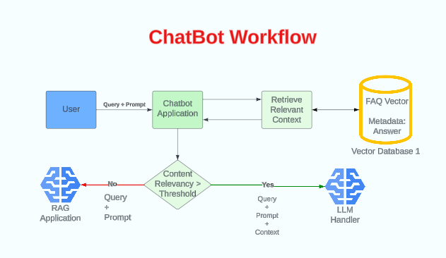
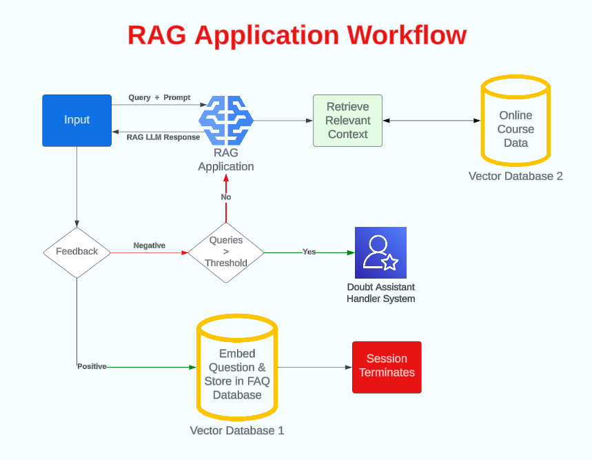
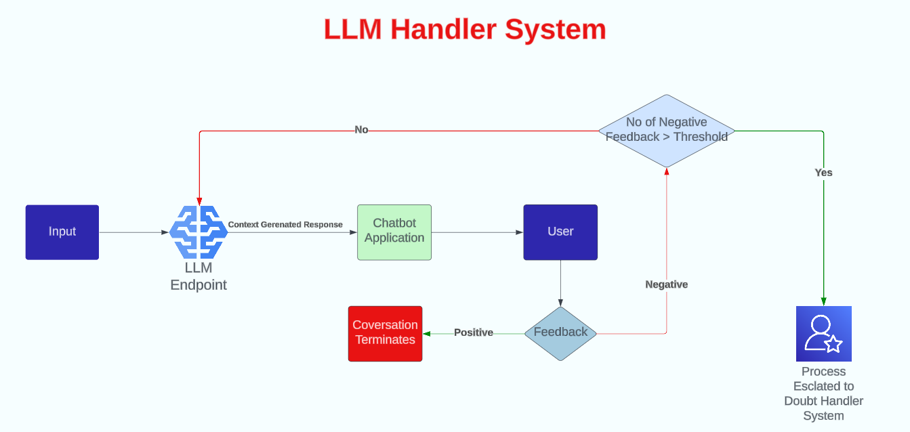
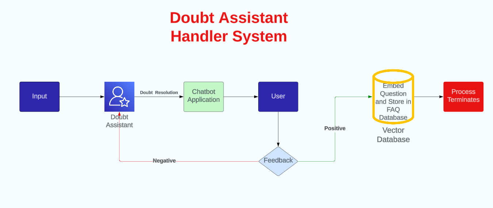

# EduBot - The EdTech Website Bot

This repository contains the entire codebase for a chatbot built to answer user queries based on the edtech courses sold by the website.

## Overview
EduBot utilizes a RAG model with a Pinecone vector database, working in collaboration with a Coheare LLM model. Integration is facilitated by Langchain, allowing for easy integration along with custom prompt templates and maintenance of the user's chat history, along with chain responses for executing multiple tasks within a single chain. The project uses Django as the database and has two frontend applications: one for the client and another for the admin, both served by the common backend. Admin routes are kept protected, while client routes are public. The admin is responsible for answering queries that are beyond the scope of the RAG application's database.

## Workflow

<div style="display:flex; flex-wrap: wrap; align-items:center; justify-content:center">
  
  
  
  
</div>


## Deployment
Click [here](https://edu-website-client.vercel.app/) to go to the deployed website. Note that questions beyond the database scope can only be answered if there is an operator in the admin panel at that time.

## Demo
Watch the video tutorial of the demo [here](https://youtu.be/6ihIsxVj9WU).

## Steps to Reproduce
### Step 1: Clone Repository
```bash
git clone https://github.com/JaiSehgal007/Edu-Website-Chatbot
```

### Step 2: Install Node Package Manager

### Step 3: Client Frontend Setup
```bash
cd client
npm install
npm run dev
```

### Step 4: Admin Frontend Setup
```bash
cd admin
npm install
npm run dev
```

### Step 5: Backend Setup

Add a .env file in the backend directory with the following environment variables:

- `PINECONE_API_KEY`
- `PINECONE_INDEX_NAME`
- `COHERE_API_KEY`

In the backend directory, there are two Jupyter notebooks placed which were involved in the preprocessing of the database. The processed database is stored inside updated_appendix.csv in the database folder. To initialize your own Pinecone database, which will help you get the `PINECONE_INDEX_NAME`, and you can find the `PINECONE_API_KEY` on the Pinecone dashboard. You will get the `COHERE_API_KEY` after logging into the Coheare platform. To feed the records in the database, simply run the `preprocessing.ipynb` file.

After this setup follow the steps below
```bash
cd backend
pip install -r requirements.txt
cd edubot
python manage.py migrate
python manage.py createsuperuser # to create the superuser to log into the admin panel of the admin frontend
python manage.py runserver
```
Now everything is set, and all three servers are running. You may watch the YouTube video linked mentioned above to check the working.

## Contributions
Any suggestions and contributions to the project are welcomed.
